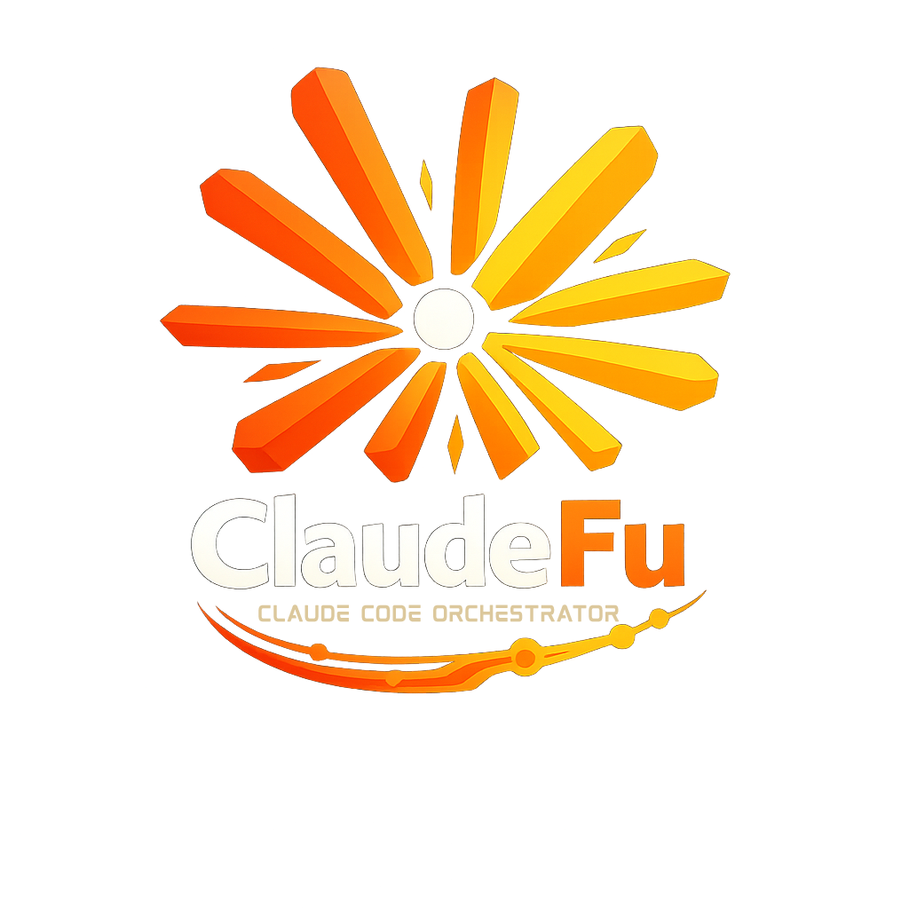

# ClaudeFu

<p align="center">
  
</p>

<p align="center">
  <strong>Multi-Claude Code Orchestration Desktop App</strong>
</p>

<p align="center">
  Visualize and interact with multiple Claude Code CLI sessions from a unified interface.
</p>

---

## Features

- **Multi-Agent Dashboard** - Manage multiple Claude Code instances across different project folders - single interface, many Claude Codes
- **Real-Time Session Viewing** - Watch Claude's conversation as it streams via JSONL file watching
- **Tool Call Visualization** - Expandable tool use/result blocks with formatted inputs and outputs
- **Interactive AskUserQuestion** - Answer Claude's questions directly in the UI (even in `--print` mode)
- **Subagent Viewer** - Inspect Task tool spawned subagent conversations
- **Thinking Blocks** - Collapsible extended thinking display
- **Context Compaction** - View summary cards when Claude compacts conversation history
- **Unread Tracking** - Badge indicators for sessions with new activity

## Roadmap

- **Multi-Agent Orchestration** - `@backend create API, @frontend build UI` style coordination
- **Parallel Agent Execution** - Run multiple agents simultaneously with dependency resolution
- **Dynamic MCP** - Agent-to-agent communication via dyanmic agent MCP tools, auto-prompting to broadcast and request information from other agents

## Tech Stack

- **Backend**: Go with [Wails](https://wails.io/) framework
- **Frontend**: React + TypeScript + Vite
- **Styling**: Tailwind CSS
- **Data**: Claude Code JSONL session files (`~/.claude/projects/`)

## Architecture

### Core Principles

- **Single Source of Truth** - All state lives in Go backend, frontend is a view
- **Event-Driven** - State changes flow through Wails events, not polling
- **UUID Everywhere** - Workspace, Agent, Session all have stable UUIDs for event routing

### Domain Model Hierarchy

```
Workspace (container)
└── Agent (Claude Code instance tied to a folder)
    └── Session (conversation in ~/.claude/projects/{folder}/)
        └── Subagent (Task tool spawned agents)
```

### Communication Flow

```
┌─────────────────────┐                  ┌─────────────────────┐
│   Frontend (React)  │                  │   Backend (Go)      │
│                     │                  │                     │
│  ───Bound Methods──────────────────▶  │  WorkspaceRuntime   │
│     SendMessage()   │                  │  AgentState         │
│     GetSessions()   │                  │  SessionState       │
│                     │                  │                     │
│  ◀────Wails Events─────────────────   │  FileWatcher        │
│     session:messages│                  │  (fsnotify)         │
│     unread:changed  │                  │                     │
└─────────────────────┘                  └─────────────────────┘
                                                   │
                                                   ▼
                                         ~/.claude/projects/
                                         └── {encoded-folder}/
                                             └── {session}.jsonl
```

### File Watcher Strategy

ClaudeFu uses `fsnotify` to watch Claude Code's session directories. When changes occur:

1. **Delta reads** - Only read new bytes from JSONL files
2. **Parse incrementally** - Convert new lines to messages
3. **Emit events** - Push updates to frontend via Wails runtime
4. **Recalculate unread** - Update badge counts

### Data Storage

**Claude Code sessions** (read-only, watched by ClaudeFu):
```
~/.claude/projects/
└── {encoded-folder}/              # Folder path with / → -
    ├── {session-id}.jsonl         # Main conversation
    └── {session-id}/
        └── subagents/
            └── agent-{id}.jsonl   # Task agent conversations
```

**ClaudeFu config** (managed by ClaudeFu):
```
~/.claudefu/
├── workspaces/
│   └── {workspace-id}.json        # Workspace with agents list
├── current_workspace.txt          # Active workspace ID
└── session_state.json             # Last viewed timestamps (for unread tracking)
```

## Installation

### Via Homebrew (Recommended)

```bash
brew tap metaphori-ai/claudefu
brew install --cask claudefu
```

**Upgrade to latest version:**
```bash
brew upgrade --cask claudefu
```

> **Note:** For unsigned builds, macOS may block the app. Right-click → Open, or run:
> ```bash
> xattr -cr /Applications/ClaudeFu.app
> ```

### Prerequisites

ClaudeFu requires the Claude Code CLI:

```bash
npm install -g @anthropic-ai/claude-code
```

### Build from Source

```bash
# Clone the repository
git clone https://github.com/metaphori-ai/claudefu.git
cd claudefu

# Install frontend dependencies
cd frontend && npm install && cd ..

# Development mode with hot reload
wails dev

# Production build
wails build
```

## Usage

1. **Add Agents**: Click the "+" button and select folders containing Claude Code projects
2. **View Sessions**: Select an agent to see its conversation sessions
3. **Real-Time Updates**: Sessions update live as Claude Code runs in that folder
4. **Answer Questions**: When Claude asks an AskUserQuestion, click options or type custom answers directly in ClaudeFu

## How It Works

ClaudeFu watches Claude Code's JSONL session files in `~/.claude/projects/{encoded-folder}/`. Each conversation turn is stored as a JSON line containing:

- User messages and tool results
- Assistant responses with tool calls
- System events (compaction summaries, file history snapshots)

The app parses these events using a discriminated union classifier and renders them in a rich chat interface.

### AskUserQuestion Interception

When Claude Code runs in `--print` mode, interactive tools like `AskUserQuestion` auto-fail. ClaudeFu detects these failures, presents an interactive UI, and patches the JSONL with your answer to resume the conversation.

## Project Structure

```
claudefu/
├── app.go                    # Wails app with bound methods
├── internal/
│   ├── providers/            # Claude CLI integration
│   ├── runtime/              # Session state management
│   ├── types/                # JSONL parsing & classification
│   ├── watcher/              # File system watcher
│   └── workspace/            # Workspace & agent management
└── frontend/
    └── src/
        ├── components/       # React components
        │   ├── ChatView.tsx  # Main conversation view
        │   ├── ToolCallBlock.tsx
        │   └── ...
        └── App.tsx
```

## License

MIT

## Acknowledgments

- Built with [Wails](https://wails.io/)
- Integrates with [Claude Code](https://claude.ai/claude-code) by Anthropic
